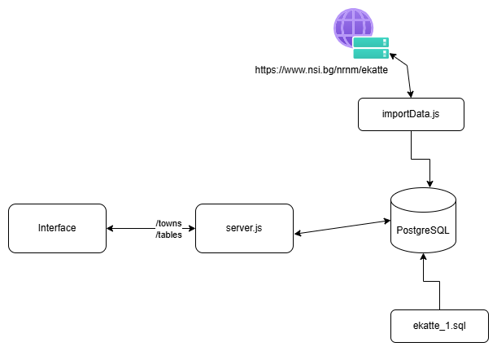
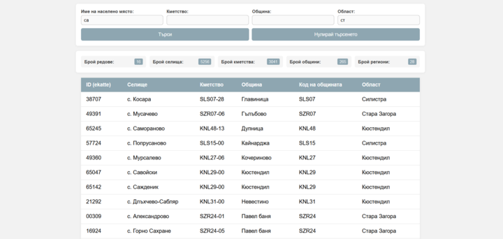

# EKATTE

## Цел

Целта на проекта е:

* Да се създаде база данни съдържаща всички селища, кметства, общини и области в България, като се използва информацията от EKATTE (EKATTE файлове). Базата данни трябва да бъде в трета нормална форма (3NF), с правилно дефинирани primary и foreign keys, индекси и constraints.
* Да се напише програма, която да импортира данните от ЕКАТТЕ файловете в базата данни.
* Да се разработи уеб интерфейс през който да се търси информация за съществуващите селища

## Използвани технологии

* JavaScript/NodeJS
* PostgreSQL
* HTML/CSS

## Използвани библиотеки

* `jest` - за unit тестове
* `jest-fetch-mock` - за симулация на fetch при тестовете
* `pg` (node-postgres) - за връзка с базата данни
* `dotenv` - за променливи на средата

## Структура

В папката __`./db`__ се съдържа скриптът за инициализирането на базата и модулът отговорен за връзката с базата и правенето на заявки

В папката __`./src`__ се запазват изтеглените файлове, от които си извичаме информацията

В папката __`./tests`__ се съдържат тестовете за модулите и функции

В папката __`./interface`__ са статичните файлове за интерфейса.

## Как работи

### Схема


### Качване на данни в базата

#### Теглене на файлове

Модулът __`downloadFiles.js`__ отговаря за това. 

Имаме функция__`getFile`__, която приема линк за файла и дестинация. По принцип файловете, който на нас ни трябват, не надвишават __2,5 MB__, така че можем да си позволим да ги заредим в памет и да ги запазим. Имплементацията тук го прави чрез __fetch__ към линка за файла, който получава __json__ отговор и файла го получаваме в тялото на отговора. Функцията ни връща __Promise__ и така разбираме, кога файлът е изтеглен и готов за четене.

__`downloadFiles`__ функцията ни приема масив от линкове за файлове и дестинации. За всеки файл от масива извикваме функцията __`getFile`__ за взимане на файл.

#### Връзка с базата и изпълняване на заявки

Модулът __`./db/index.js`__ отговаря за връзката с базата и изпълнението на заявки.
Тук използваме променливите на средата в папката __`.env`__
```
PGUSER=
PGPASSWORD=
PGHOST=
PGPORT=
PGDATABASE=
```
Създаваме си обект __pool__, който ни управлява връзките с базата.

Имаме функция __query__, която приема заявка и аргументи. Хващаме грешка, ако има от заявката.

Имаме и функция __end__, която ни прекратява връзката с базата.

#### Качване на данните в базата

Логиката за качване на данните от файловете към базата се съдържа в __`updateDB`__. 
Идеята е да изтрием всичко от таблиците досега и да попълним данните от файловете за региони, общини, кметства и селища. 

За всяка една таблица си четем файла и филтрираме стойностите да сме сигурни, че са валидни, после правим трансформация на данните, ако се налага, и получаваме масив с вече валидните данни. Така за всеки елемент от масива минаваме и изпълняваме заявка за качване в базата.

В една транзакция е сложено всичко това, така че ако стане грешка по време на изпълнението просто правим *rollback* и връщаме състоянието на базата. Преди да започнем да слагаме в базата, затриваме всички предишни данни, за да осигурим, че няма да има стари останали.

По начина, по който е направено в момента, всяка заявка изчаква предишната преди да се изпълни и за всеки отделен обект правим по една заявка. Понеже нямаме много количество данни (около 9000) и в бъдеще числото няма да се промени, това решение е достатъчно, като отнема около __2,5__ секунди за изпълнението на локална машина.

#### Изпълняване на скрипта

1. Създавате си база в __PostgreSQL__ и импортирате от sql файла за структурата.

2. Изпълнявате __`importData.js`__, като преди това сте си конфигурирали променливите на средата, за да може да се свърже с базата.

### API 

#### Endpoints

* `/tables` - връща броя редове във всяка от таблиците
* `/towns` - връща всички селища и информация за тях. Могат да се доабвят параметри за търсенето по име на селище, кметство, община и регион. Изглежда като `/towns?name=var&municipality=vra` и получаваме селища, чийто име съдържа __var__ и общината съдържа __vra__. Търсенето работи и на кирилица.

#### Описание на кода

Сървърния код е в __`server.js`__. Вътре правим един http сървър, който слуша на __PORT 3000__, приема само __GET__ заявки и има два endpoint-а. Сървърът слуша за събития __'request'__.

Ако извикаме `/tables` в сървъра се извиква `getTablesRowCounts()` от модулът __`serverFunctions.js`__, което прави заявки към базата и получаваме резултата, който връщаме като json.

За `/towns` е по-особено. Събираме си параметрите от заявката  и ги слагаме да за празен string, ако липсват или не са дефинирани.
```
const params = {
            town: parsedURL.query.town || '',
            townhall: parsedURL.query.townhall || '',
            municipality: parsedURL.query.municipality || '',
            region: parsedURL.query.region || ''
        };
```

Това го правим, защото можем да търсим по няколко имена наведнъж и заявката ни изглежда така:
```
const query = `SELECT t.id, t.type, t.name_bg as town, th.name_bg as townhall, m.name_bg as municipality, r.name_bg as region
FROM towns t LEFT JOIN townhalls th ON t.townhall_id = th.id
	    JOIN municipalities m ON t.municipality_id = m.id
	    JOIN regions r ON r.id = m.region_id
		WHERE ($1 = '' OR t.name_bg ~* $1 OR t.name_en ~* $1)
            AND ($2 = '' OR th.name_bg ~* $2 OR t.name_en ~* $2)
            AND ($3 = '' OR m.name_bg ~* $3 OR m.name_bg ~* $3)
            AND ($4 = '' OR r.name_bg ~* $4 OR r.name_en ~* $4)`;
```

Join-ваме всички таблици по ключовете, като правим __LEFT JOIN__ за кметствата, защото не всеки град е част от кметство.
За всяко име проверяваме и името на латински, и името на български, защото не знаем кое е подадено, а искаме да можем и по двете да търсим.

Ако не е подедено име на регион примерно, в предишната стъпка го правим на празен стринг. Тук първо проверяваме това за да върне вярно за всички критерии, по които не търсим.

### Интерфейс

#### HTML 

Имаме прост html файл, който съдържа форма за търсенето, секция за броя редове в базата и таблица, в която са селищата заедно с информация за тях.


#### JavaScript

Тук нещата са по-интересни.

```
document.addEventListener('DOMContentLoaded', async () => {
    await initTable();
});
```
При зареждане на html-а имаме event, който извиква функция `initTable()`, която прави заявка към сървъра, форматира резултата и за всяко селище добавя ред в таблицата динамично.

Друг event, който следим е натискане на копчето от формата:
```
document.getElementById('search-form').addEventListener('submit'
```

При натискане на бутона за търсенето от формата събираме попълнената информация от полетата за търсене и ги добавяме към url-а на request-а. Изпращаме заявка към сървъра и резултата се показва чрез `populateTable()` функцията, която приема данните и за всеки ред добавя в таблицата.

### Пускане на интерфейса
За да работи интерфейса ни е нужно api-то, от което взимаме данните за селищата, и един сървър, който да ни сервира статичните файлове.

#### API
Нужно е само да изпълним командата

```node server.js``` и започва да слуша на port __3000__

#### HTML страница
В __`./interface`__ директорията изпълняваме командата

```python -m http.server 8000```

Така можем да достъпим страницата през `localhost:8000`
